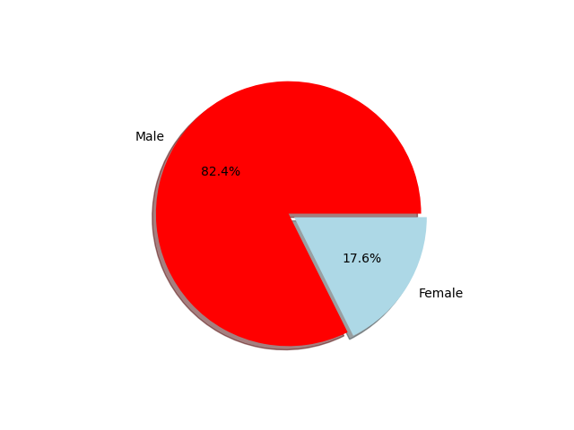
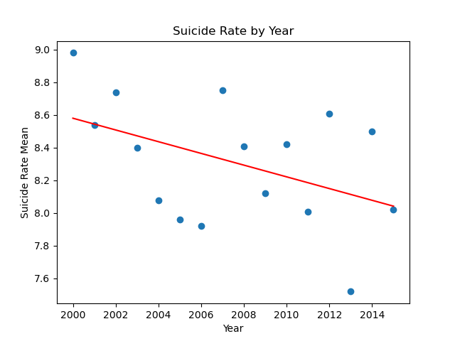

# projectone-groupsix

Our group decided to analyze the subject of suicide in the Americas
The motivation behind our subject matter was an interest in applying the skills we have learned thus far to a real-world issue
We chose specific variables that we agreed may have contributed and/or correlated with suicide rates in various countries
We took into account; GDP per country, Gender, Year, Age Range and Geographic Location, as variables that may have similar trends to the Suicide Rate Mean
Our goal is not to form our analysis from a predetermined outcome; but rather, our objective is to create a narrative from our findings through the data.

Our Research Questions and Analysis
    
    
     Question #1: Does Gender present a disproportionate or proportionate role in Suicide Rates of sampled countries?

        
        Analysis:  Based on our findings, Suicide Rates are disproportionatly distributed between Genders. In our data set, ranging between 2000-2010, in the Americas; it was determined that Men make up 82.4% of the total Suicide Rate. Women accounted for the the remaining 17.6 % of the total Suicide Rate.

    Question #2: Does the average GDP of sampled countries significantly impact Suicide Rates?

       Analysis: It is evident that we required additional variables to find a stronger correlation between the GDP and the Suicide Rate. Although we were able to see some similarities and trends, more data input is required to draw a stronger conclusion.

    Question #3: Is there a relationship between Age-Range and Suicide Rate?
    

        Analysis: According to our data analysis, Age-Range is most certainly related to suicide rate. Within our data set, the 75+ age group had the highest Suicide Rate for every year analyzed. While the numbers vary slightly, a conclusion can be made that Age Range increases the Rate of Suicide. 
        

   Question #3: Based on our findings from the 2000-2010 data set, is there potential to create a reliable way to predict future Suicide Rates? 

Notes on Group Participation:

Our group collaborated on the code and presentation using our individual strengths and met on a daily basis throughout the project. We feel that we prioritized supporting the group effort well and worked very well together. 
We decided as a group that Elyse Sulkey and Russ Collins would present the presentation on behalf of the group. We did this in the interest of presenting the group work in a clear and cohesive manner.

